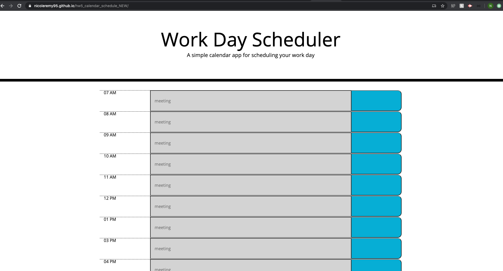
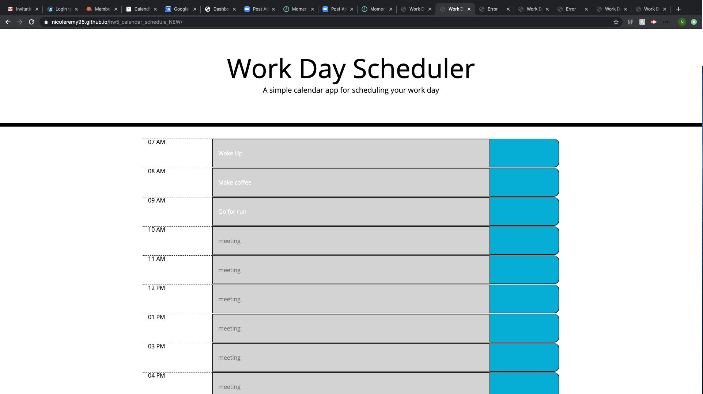

# hw5_calendar_schedule_NEW
calendar schedule 
In this project, I have created a calendar using moment.js, HTML, jQuery, and CSS. This calendar saves the users input into the local storage and shows the input even after the page refreshes. 

The rows corresponding to each hour also update color based upon the current time. If it is the present hour, the row input turns pink. If the hour is in the past, the color is white. If the hour is in the future, the row turns green. 

## Images of Completed Website 

### Step 1

### Step 2

## Link to Site

Deployed website [calendar](https://nicoleremy95.github.io/hw5_calendar_schedule_NEW//)

## Contributing
Pull requests are welcome. For major changes, please open an issue first to discuss what you would like to change.

Please make sure to update tests as appropriate.

## License
[NER](https://choosealicense.com/licenses/mit/)